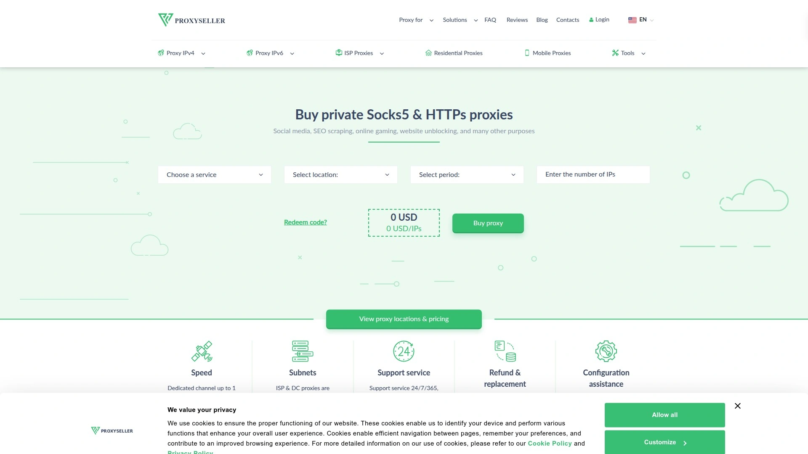
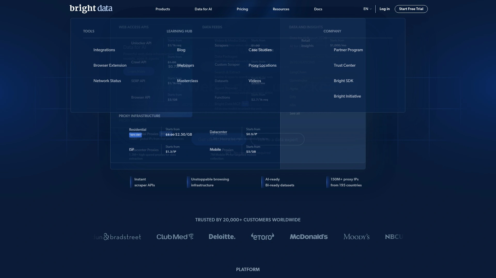
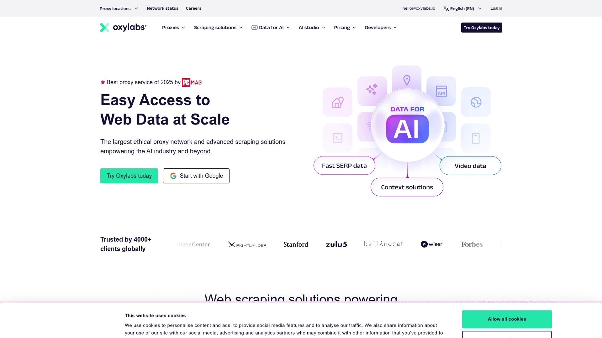
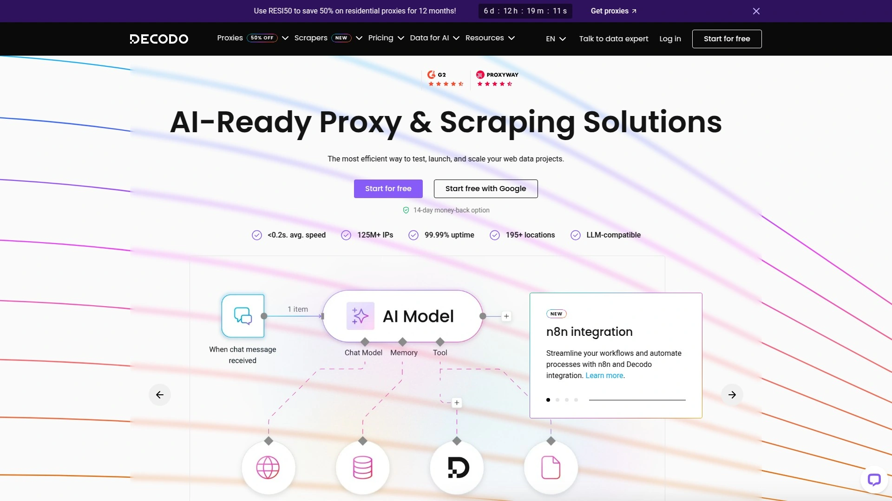
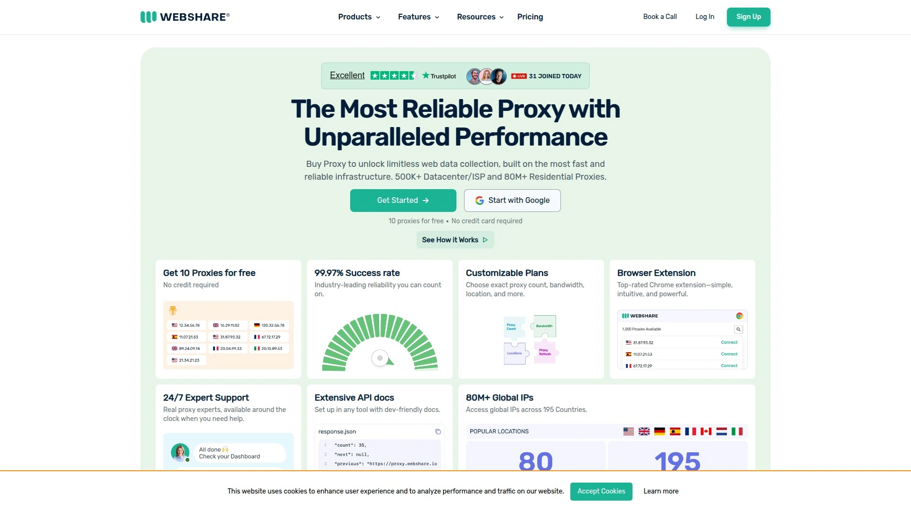
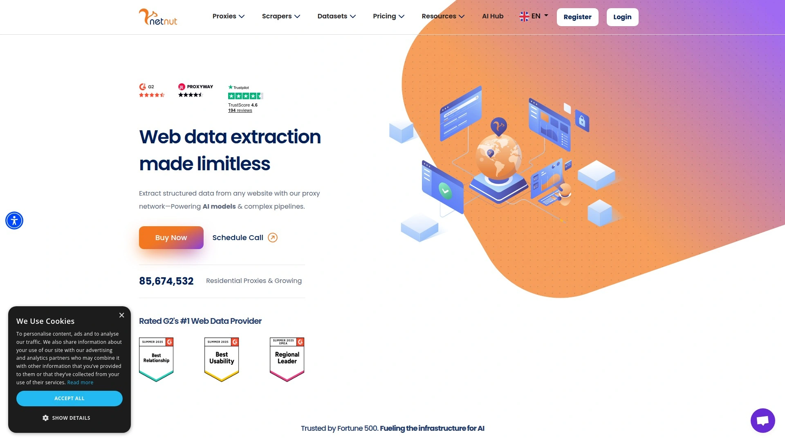
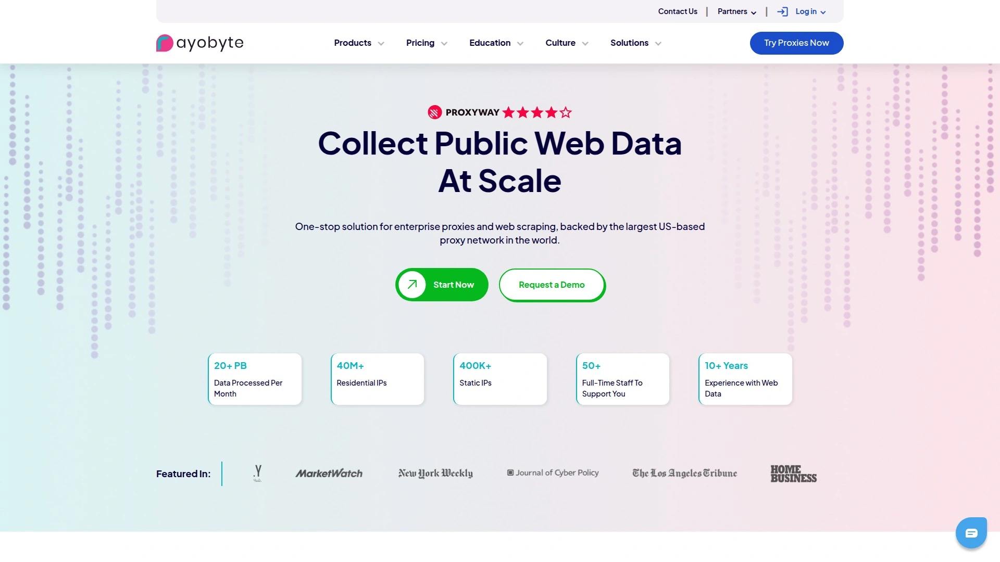

# No More IP Bans! Recommend 9 High-Performance Proxy Game-Changers

Scraping data, managing multiple accounts, or accessing geo-restricted content shouldn't end with constant blocks and CAPTCHAs. Whether you're running e-commerce price monitoring, social media management, or ad verification campaigns, reliable proxy services mask your real IP and route traffic through legitimate residential or datacenter addresses—keeping your operations running smoothly without detection.

***

## **[Proxy-Seller](https://proxy-seller.com)**

Affordable private proxies delivering stability without complicated setups.

Proxy-Seller specializes in private SOCKS5 and HTTPS proxies providing dedicated IP addresses for users seeking straightforward, budget-friendly solutions. The service focuses on individual users and small businesses needing clean proxies for various online activities without enterprise-level complexity.

**Core offerings include** datacenter proxies with dedicated IP assignment, meaning each proxy belongs exclusively to you rather than being shared across multiple users. This dedicated structure reduces the risk of blacklisting from other users' actions and provides more predictable performance.

Protocol support covers both HTTP/HTTPS and SOCKS5, giving flexibility for different use cases. SOCKS5 handles any traffic type including torrenting, gaming, and applications beyond web browsing, while HTTP proxies excel for standard website access and scraping tasks.

**Geographic coverage** spans major locations worldwide, allowing users to select specific countries or cities for their proxy IPs. This targeting proves valuable when accessing region-specific content or conducting market research requiring local presence.

The platform provides instant activation after purchase—proxies become available immediately through your dashboard with connection credentials. No waiting periods or approval processes delay your access, enabling quick deployment for time-sensitive projects.

Pricing structures emphasize affordability with transparent costs based on number of proxies and subscription duration. Monthly plans provide flexibility while longer commitments unlock volume discounts, making it economical for ongoing needs.

User interface remains simple and functional, displaying your active proxies with credentials, expiration dates, and usage statistics. The straightforward dashboard suits users wanting minimal complexity—just grab your proxy details and configure your applications.

Best suited for individual users, small teams, and businesses requiring dedicated datacenter proxies at reasonable prices without needing advanced features like rotating residential IPs or AI-powered routing.

## **[Bright Data](https://brightdata.com)**

Enterprise-grade proxy infrastructure powering Fortune 500 data collection at scale.

Bright Data operates the industry's largest and most sophisticated proxy network with 72+ million residential IPs, 1.6+ million datacenter proxies, 1.3+ million static residential (ISP) proxies, and extensive mobile IP coverage across 195 countries. This comprehensive infrastructure makes it the go-to solution for businesses requiring guaranteed uptime and massive scale.

**Residential proxy network** provides 72 million real device IPs shared through ethical resource-sharing programs where users voluntarily join the network. The system offers country, city, ASN, ZIP code, and even GPS coordinate targeting with rotation options customizable per request or sticky sessions lasting as long as needed.

Static residential proxies deliver ISP-assigned IPs leased exclusively for your use, maintaining the same address indefinitely with unlimited bandwidth. These combine residential legitimacy with datacenter stability—perfect for maintaining consistent identity across long sessions without rotation disruptions.

Datacenter proxies come in four configurations: shared pay-per-usage pools with 20,000 rotating IPs, shared pay-per-IP with set fees per address, dedicated IPs assigned exclusively to single users, and premium IPs offering superior speed and lower detection rates. Pricing flexibility accommodates both high-volume scraping and targeted access needs.

**Advanced features** distinguish Bright Data from basic providers. The Proxy Manager software enables sophisticated configurations including custom rotation rules, domain whitelisting/blacklisting, DNS resolution location selection, and request caching reducing costs by 5%. Integration with Puppeteer, Selenium, and major scraping frameworks happens seamlessly.

Protocols support HTTP, HTTPS, and SOCKS5 with UDP compatibility. The network handles unlimited concurrent connections without throttling, allowing massive parallelization for enterprise scraping operations. Geographic load balancers optimize routing for speed and reliability.

Web Unlocker service automatically bypasses CAPTCHAs, anti-bot systems, and sophisticated blocking mechanisms using machine learning and browser fingerprinting. This proves invaluable for scraping complex sites like Amazon, Google, social platforms, and travel aggregators that actively combat automated access.

**Compliance and ethics** underpin Bright Data's operations. The company maintains 100% GDPR compliance, ethical IP sourcing with full user consent, and cyber insurance coverage protecting clients from network-related damages. Legal teams ensure operations align with data protection regulations globally.

Pricing reflects enterprise positioning—residential proxies start at $8 per GB, datacenter from $12 monthly, ISP proxies from $16 monthly, and Web Unlocker from $75 monthly. Free trials provide 7 days with limited bandwidth for testing before commitment.

## **[Oxylabs](https://oxylabs.io)**

Premium proxy solution combining massive IP pools with sophisticated scraping tools.

Oxylabs maintains one of the industry's most reliable and extensive proxy networks with 102+ million residential IPs, 2+ million datacenter proxies, and dedicated infrastructure across 195 countries. The provider targets mid-market to enterprise clients requiring guaranteed performance and advanced tooling.

**Residential proxies** deliver consistent speeds with 99.9% uptime backed by real user devices across global locations. Country, city, state, and ASN-level targeting enables precise geographic positioning. Session control allows sticky IPs lasting up to 30 minutes or rotation with each request.

Datacenter proxies provide blazing-fast speeds through premium server infrastructure with both shared and dedicated options. Shared pools offer cost-effective access for high-volume tasks, while dedicated IPs ensure clean reputation and predictable performance for sensitive operations.

Static residential (ISP) proxies combine datacenter speed with residential legitimacy—real ISP-assigned IPs that don't rotate, perfect for account management, sneaker copping, and long-duration sessions where consistent identity matters. These support unlimited bandwidth with 100 concurrent sessions per proxy.

**SOCKS5 protocol support** extends functionality beyond basic HTTP connections. Configure SOCKS5 through the dashboard or Proxy Manager software for applications requiring UDP protocol, P2P connections, or non-web traffic. Port flexibility supports custom configurations for specialized use cases.

Web Scraper API automates data extraction from complex websites without managing proxy infrastructure directly. The service handles rotating IPs, CAPTCHA solving, JavaScript rendering, and anti-bot evasion automatically—you just specify target URLs and receive structured data.

Integration ecosystem provides ready-made connections for Puppeteer, Playwright, Selenium, and popular scraping libraries. Extensive documentation and code examples accelerate implementation across Python, Node.js, PHP, and other languages.

**Support infrastructure** includes 24/7 assistance through live chat with response times under 1 minute, dedicated account managers for enterprise clients, and comprehensive knowledge base covering common scenarios. Users consistently praise the knowledgeable support team's responsiveness.

Pricing starts at $8 per GB for residential proxies, with datacenter plans from $6.75 monthly and ISP proxies from $16 monthly. The investment matches premium positioning—companies prioritizing reliability and advanced features over budget considerations.

Enterprise clients benefit from custom solutions, volume discounts, and white-glove onboarding. Oxylabs' infrastructure powers data operations for Fortune 500 companies requiring guaranteed SLAs and compliance certifications.

## **[IPRoyal](https://iproyal.com)**

Ethically-sourced proxies at competitive prices with never-expiring traffic.

IPRoyal delivers 32+ million residential IPs across 195 countries with pricing starting at $1.75 per GB and a unique value proposition—purchased traffic never expires. This no-deadline model eliminates pressure to consume bandwidth quickly, making it cost-effective for projects with variable demand.

**Residential proxy features** include country, state, and city-level targeting with both rotating and sticky session options. Sticky sessions maintain the same IP for up to 7 days, supporting use cases requiring consistent identity like social media management or account verification.

Unlimited concurrent sessions remove restrictions on parallelization—run as many simultaneous connections as your projects require without throttling or additional fees. Auto-rotation replaces IPs automatically based on time intervals you set (seconds, minutes, hours, or days), while manual rotation enables single-click IP changes through dashboard or API.

Static residential proxies provide 500,000+ dedicated ISP-assigned IPs from premium providers across 31+ countries with unlimited bandwidth and 99.9% uptime. These IPs remain stable over time, assigned exclusively to you without sharing. SOCKS5 support with UDP and TCP connections extends functionality beyond basic HTTP.

**Datacenter proxies** start at $1.39 per IP with high-speed connections through global server infrastructure. These suit tasks prioritizing speed over residential legitimacy—competitive intelligence gathering, brand protection monitoring, or high-velocity scraping operations.

The self-service dashboard simplifies proxy management with intuitive controls for customizing preferences, monitoring traffic usage, and generating new credentials. API access enables programmatic proxy management for automated workflows.

Ethical sourcing practices ensure all residential IPs come from users who voluntarily participate in the network with full transparency. No deceptive installations or hidden proxy software—participants knowingly contribute bandwidth in exchange for benefits.

Bulk discounts maximize savings when ordering larger traffic volumes while maintaining performance standards. The no-contract model provides flexibility—purchase what you need without long-term commitments or complicated agreements.

Best suited for cost-conscious businesses seeking reliable residential and ISP proxies without pressure to consume purchased bandwidth within strict timeframes. The never-expiring traffic model uniquely benefits projects with seasonal or unpredictable demand patterns.

## **[SOAX](https://soax.com)**

AI-powered proxy platform delivering premium mobile and residential IPs.

SOAX operates a 191+ million IP network combining 155+ million residential proxies and 33+ million mobile IPs across 195+ locations. The platform emphasizes AI-driven routing, ethical sourcing, and sophisticated targeting capabilities for businesses requiring mobile-specific connectivity.

**Mobile proxy network** provides genuine 5G, 4G, 3G, and LTE connections from real mobile devices and carrier networks. Mobile IPs prove invaluable for social media automation, ad verification, app testing, and scenarios where websites treat mobile traffic preferentially. The rotating mobile proxies maintain clean reputations with extremely low block rates.

Residential proxy pool delivers authentic IPs from home internet connections across every continent with country, state, and city targeting. Flexible rotation options include per-request rotation for maximum IP diversity or sticky sessions up to 24 hours for maintaining consistent presence.

**AI-powered routing** optimizes connection paths automatically, selecting the fastest and most reliable routes based on real-time network conditions. This intelligent traffic management improves success rates and reduces latency compared to static routing approaches.

Advanced targeting goes beyond basic geography—filter by device type (desktop, mobile, tablet), operating system, browser type, and even specific ASNs (Autonomous System Numbers). This granular control enables precise traffic mimicking for sophisticated anti-detection.

Unlimited concurrent connections and bandwidth suit high-volume operations without throttling concerns. The platform supports HTTP, HTTPS, and SOCKS5 protocols with flexible authentication options including username/password and IP whitelisting.

**Dashboard experience** provides intuitive proxy management with real-time usage monitoring, detailed analytics, and quick configuration options. API access enables programmatic control for developers integrating proxy rotation into automated workflows.

Ethical sourcing ensures 100% legitimate IP acquisition through transparent user consent. All network participants voluntarily join after clear disclosure, avoiding the questionable practices plaguing some residential proxy providers.

Pricing reflects premium positioning with residential proxies starting around $99 monthly for meaningful traffic volumes and mobile proxies commanding higher rates due to infrastructure costs. The investment suits businesses where mobile IP authenticity and AI-optimized routing justify premium costs.

## **[Smartproxy (Decodo)](https://decodo.com)**

Beginner-friendly proxy platform balancing affordability with comprehensive features.

Smartproxy (now operating as Decodo) provides 125+ million IPs across residential, datacenter, ISP, and mobile proxy types with emphasis on user-friendly setup and competitive pricing. The platform targets users wanting advanced functionality without steep learning curves.

**Residential proxies** start at $1.5 per GB with pay-as-you-go and subscription options. The 40+ million IP pool covers global locations with city-level targeting, rotating or sticky sessions up to 30 minutes, and unlimited concurrent connections. Session control enables maintaining consistent IPs for account-based tasks.

Static residential (ISP) proxies combine residential legitimacy with datacenter stability through ISP-assigned IPs that don't rotate. These support unlimited bandwidth with pricing starting around $4.60 per IP, making them cost-effective for long-duration sessions and account management.

Datacenter proxies deliver high-speed performance at $1 per IP monthly with 400,000+ IPs across global locations. Shared and dedicated options accommodate different budget levels and reputation requirements. The datacenter network suits tasks prioritizing speed over residential authenticity.

**Mobile proxy offering** provides genuine 3G/4G/5G connections from real carrier networks with 10+ million IPs. Pricing starts at $50 monthly for 2GB, positioning mobile access at premium levels justified by infrastructure costs and higher success rates against mobile-optimized anti-bot systems.

Setup simplicity distinguishes Smartproxy from more complex enterprise providers. Browser extensions, configuration generators, and API integration helpers reduce technical barriers. The 14-day money-back guarantee provides risk-free testing for new users evaluating fit.

**Protocol support** includes HTTP, HTTPS, and SOCKS5 across all proxy types. Port flexibility and authentication options (username/password or IP whitelist) enable compatibility with diverse tools and applications.

Dashboard interface prioritizes clarity with usage tracking, quick proxy generation, and straightforward configuration options. Even users without extensive proxy experience navigate the system confidently, reducing onboarding time.

Best suited for small to medium businesses seeking affordable, reliable proxies with gentle learning curves. The platform balances comprehensive features with accessibility, avoiding the overwhelming complexity of enterprise-focused competitors.

## **[Webshare](https://www.webshare.io)**

Budget-champion proxy service offering free tier and industry-low pricing.

Webshare disrupts proxy pricing with 10 free premium datacenter proxies and paid plans starting at $2.99 monthly for 100 proxies. The platform emphasizes value without sacrificing performance, making professional-grade proxies accessible to bootstrapped operations and individual users.

**Free tier provides** genuine utility rather than limited trials—10 private datacenter proxies running indefinitely at zero cost with speeds matching paid alternatives. This enables long-term testing and suits low-volume use cases without financial commitment.

Datacenter proxy plans scale from 100 proxies at $0.0299 each monthly to 60,000 proxies at $0.0179 per IP with annual subscriptions delivering 33% additional savings. The transparent pricing without hidden fees makes cost planning straightforward.

**Static residential proxies** provide ISP-assigned IPs with unlimited bandwidth starting at $4 monthly for 20 IPs under annual plans. Scaling to 10,000 static residential IPs costs $1,500.75 monthly ($0.18 per proxy), maintaining affordability even at significant scale.

Rotating residential proxies charge by bandwidth rather than IP count with flexible monthly or pay-as-you-go options. This pricing model suits scraping operations where traffic volume matters more than specific IP counts.

Protocol support covers HTTP, HTTPS, and SOCKS5 with all proxy types. The rotating proxy endpoint simplifies setup—configure once and traffic automatically rotates through the pool without manual IP management.

**Dashboard functionality** enables quick proxy generation, usage monitoring, and plan customization. API documentation supports programmatic proxy management for developers building automated workflows. The self-service approach minimizes support dependency.

Geographic targeting spans major locations globally with country and city-level precision. USA proxies comprise a significant portion of inventory with 6.6+ million IPs available for American targeting needs.

Performance remains solid despite aggressive pricing—speeds match premium datacenter providers while stability supports production workloads. The platform proves that affordable doesn't necessitate compromising quality.

Best suited for cost-sensitive users, students, small businesses, and anyone wanting professional proxy access without enterprise budgets. The free tier and low-cost plans democratize proxy technology traditionally priced out of reach.

## **[NetNut](https://netnut.io)**

Direct ISP connections delivering unprecedented speed and stability.

NetNut differentiates through direct relationships with Internet Service Providers rather than aggregating residential IPs from peer-to-peer networks. This architecture provides faster speeds, higher success rates, and more stable connections compared to traditional residential proxy approaches.

**Direct ISP proxy network** routes traffic through actual ISP infrastructure with legitimate residential IP addresses. The one-hop connection between you and target websites eliminates intermediary routing, reducing latency by up to 50% versus multi-hop residential networks.

Static residential proxies maintain consistent IPs perfect for account management, social media automation, and long-duration sessions requiring stable identity. Unlimited bandwidth removes metering concerns, letting you use proxies extensively without overage charges.

**Rotating residential IPs** provide fresh addresses for each request or customizable sticky sessions. The direct ISP architecture delivers 99%+ success rates against even sophisticated anti-bot systems because traffic originates from legitimate ISP infrastructure rather than consumer devices.

Premium network performance stems from partnerships with tier-1 ISPs globally. NetNut's IPs benefit from ISP-level reputation and routing priority, explaining the superior speeds and stability compared to peer-network approaches.

Geographic coverage emphasizes quality over quantity—while the IP pool measures smaller than aggregator networks, the direct-source architecture provides cleaner IPs with lower ban rates. Target specific countries, cities, and ASNs for precise geographic positioning.

**Use case alignment** favors businesses where speed and stability matter more than IP pool size. Ad verification companies, e-commerce price monitors, and data intelligence firms benefit from NetNut's architecture when collecting real-time data at scale.

Integration options include standard authentication methods (username/password, IP whitelist) and API access for automated proxy management. Dashboard controls provide usage monitoring and configuration management through intuitive interface.

Pricing reflects premium positioning driven by direct ISP partnerships. The investment suits operations where reduced latency, higher success rates, and superior stability justify costs above aggregator-based residential proxies.

## **[Rayobyte](https://rayobyte.com)**

Ethically-sourced proxies emphasizing transparency and unlimited bandwidth.

Rayobyte (formerly Blazing SEO) built its reputation on ethical proxy sourcing, transparent business practices, and unlimited bandwidth across residential and ISP proxy products. The company targets users prioritizing legitimate IP acquisition and straightforward pricing.

**Static residential (ISP) proxies** provide legitimate ISP-assigned IPs with unlimited bandwidth at transparent pricing. These proxies maintain consistent addresses indefinitely, supporting use cases from sneaker purchasing to account management where IP stability matters.

Ethical sourcing practices ensure all IPs come through legitimate channels with full user consent and transparency. No deceptive installations or hidden proxy software—Rayobyte's network participants knowingly contribute bandwidth, addressing industry concerns about questionable IP acquisition.

**Rotating residential proxies** deliver fresh IPs through pay-per-GB pricing with ethical sourcing standards maintained across the network. Geographic targeting enables country and city-level positioning with session control for sticky IPs when needed.

Datacenter proxies round out the offering with high-speed server-based IPs suitable for tasks where datacenter origin doesn't compromise effectiveness. These provide maximum speed at lowest costs for appropriate use cases.

Unlimited bandwidth removes usage anxiety from static residential and ISP proxies—use them extensively without metering or overage charges. This pricing transparency helps budget planning and eliminates surprise costs.

**Company transparency** distinguishes Rayobyte in an industry often characterized by opaque practices. Clear communication about sourcing methods, pricing structures, and service limitations builds trust with users concerned about proxy legitimacy.

Support quality receives consistent praise with knowledgeable staff available for technical assistance and strategic guidance. The company approaches client relationships as partnerships rather than transactional vendor arrangements.

Best suited for businesses prioritizing ethical operations, transparent pricing, and unlimited bandwidth over cutting-edge features or massive IP pools. Rayobyte appeals to users wanting reliable proxies from providers operating with integrity.

***

## FAQ

**Which proxy type works best for web scraping without getting blocked?**

Residential proxies from providers like Bright Data, Oxylabs, or SOAX deliver highest success rates for sophisticated scraping because traffic originates from real residential IPs. For sites with moderate anti-bot systems, static residential (ISP) proxies from IPRoyal or Smartproxy provide datacenter speeds with residential legitimacy at lower costs. Budget-conscious projects can start with Webshare's datacenter proxies and upgrade if blocking becomes problematic.

**How do I choose between datacenter, residential, and mobile proxies?**

Datacenter proxies excel for speed-critical tasks where sites don't aggressively block non-residential IPs—competitive intelligence, SEO monitoring, or basic scraping. Residential proxies handle sophisticated anti-bot systems and account-based activities where authenticity matters. Mobile proxies prove essential for mobile-specific verification, social media automation, and scenarios where mobile traffic receives preferential treatment.

**What's the most cost-effective proxy solution for beginners?**

Webshare provides 10 completely free datacenter proxies indefinitely, perfect for learning and low-volume testing. When scaling beyond free limits, Smartproxy balances affordability with features starting at $1.5 per GB for residential proxies. IPRoyal's never-expiring traffic eliminates pressure to consume bandwidth quickly, benefiting projects with irregular usage patterns.

***

## Finding Proxies That Actually Work

The nine providers above approach proxy services from different angles—some prioritize massive IP pools while others emphasize ethical sourcing or budget pricing—but they all solve the core challenge of maintaining anonymous, reliable internet access at scale. [Proxy-Seller](https://proxy-seller.com) serves users seeking straightforward, affordable private proxies without enterprise complexity, particularly when you need dedicated SOCKS5 and HTTP proxies with instant activation and transparent pricing. The platform delivers stable connections and clean IP reputation at accessible price points, making it ideal for individuals and small teams wanting reliable proxy access for account management, moderate scraping, or geo-targeting without navigating sophisticated dashboards or committing enterprise budgets.
